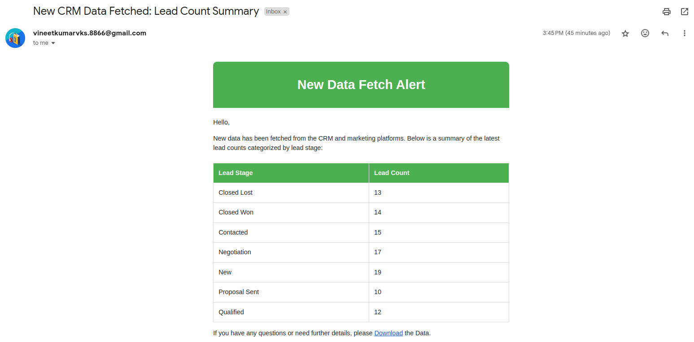

## Assignment Overview

This assignment simulates data fetching from CRM and marketing platforms, including lead and campaign data. It provides an API for generating reports in PDF or CSV format, along with email notifications for new data fetches.

## Technologies Used

- **Backend**: Django, Django REST Framework
- **Database**: SQLite
- **Report Generation**: ReportLab (for PDF), CSV module (for CSV)
- **Email Sending**: Django’s email utilities
- **Tools for Simulating Data**: Mock data using https://fabricate.mockaroo.com/
- **Frontend**: Not required for this assignment, as it focuses on backend development.

## API endpoints

-  **GET /api/fetch_lead_data**: Mock API made using DRF for Leads data
-  **GET /api/fetch_campaign_data**: Mock API made using DRF for Campaigns data

-  **/download-pdf**: Generates a PDF report using ReportLab
-  **/download-campaign-data-csv**: Generates a CSV report using CSV module
-  **/download-lead-data-csv**: Generates a CSV report using CSV module

## URL Paths

-  **/**: index page for assignment
-  **/etl**: page for ETL process
-  **/reporting-home**: page for reporting functionalities
-  **/clear_db**: to clear the database (only for demonstration purpose)

## Setup Instruction

1. Clone the repository:
    ```bash
    git clone https://github.com/itsvineetkr/ezy_metrics.git
    cd ezy_metrics
    ```
    
2. Make Virtual Environment
    ```bash
    python -m venv venv
    source venv/bin/activate  # On Windows use `venv\Scripts\activate`
    ```

3. Install the dependencies:
    ```bash
    pip install -r requirements.txt
    ```

4. Apply database migrations:
    ```bash
    python manage.py makemigrations
    python manage.py migrate
    ```

5. Run the server:
    ```bash
    python manage.py runserver
    ```

6. Access the site on `http://localhost:8000/`.

## Email Functionality

Since to send mails we need OAuth password and a host mail address, so you can add your creds in `creds.py` file in root directory.
Also since I have not build the user login/signin functionality, you need to give your email address for recieving mail. (make sure it is different from the host mail)

This is how a mail will look like:

